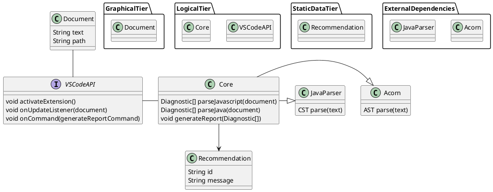
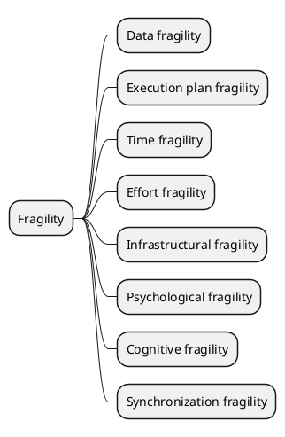

# Diagrams

```plantuml
@startuml

node PC {
    artifact VSCode {
        artifact Linter
    }
}

@enduml
```

```plantuml
@startuml

package GraphicalTier <<folder>> {
    class Document
}

package LogicalTier <<folder>> {
    class VSCodeAPI
    class Core
}

package StaticDataTier <<folder>> {
    class Recommendation
}

package ExternalDependencies <<folder>> {
    class Acorn
    class JavaParser
}

class Acorn {
    AST parse(text)
}

class JavaParser {
    CST parse(text)
}

interface VSCodeAPI {
    void activateExtension()
    void onUpdateListener(document)
    void onCommand(generateReportCommand)
}

class Document {
    String text
    String path
}

class Recommendation {
    String id
    String message
}

class Core {
    Diagnostic[] parseJavascript(document)
    Diagnostic[] parseJava(document)
    void generateReport(Diagnostic[])
}

Document -down- VSCodeAPI
VSCodeAPI - Core
Core -down-> Recommendation
Core -right-|> Acorn
Core -right-|> JavaParser


@enduml
```

```plantuml
@startmindmap
* Fragility
** Data fragility
** Execution plan fragility
** Time fragility
** Effort fragility
** Infrastructural fragility
** Psychological fragility
** Cognitive fragility
** Synchronization fragility
@endmindmap
```
