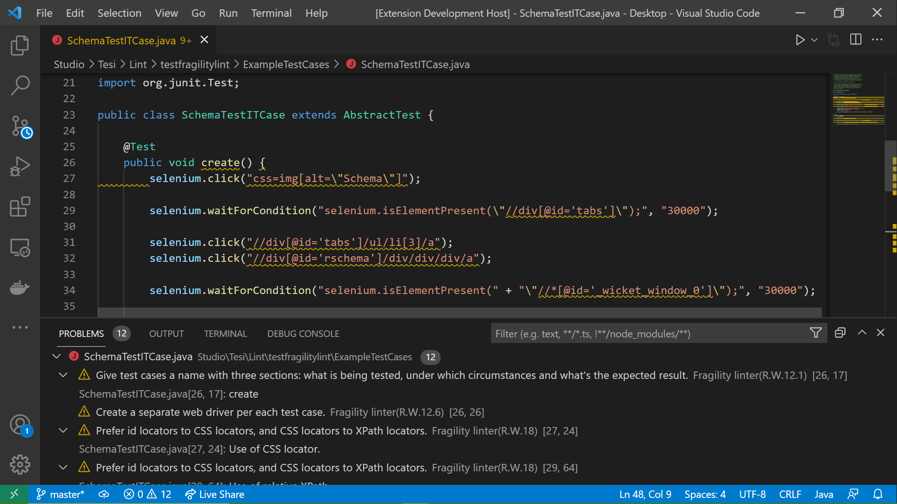
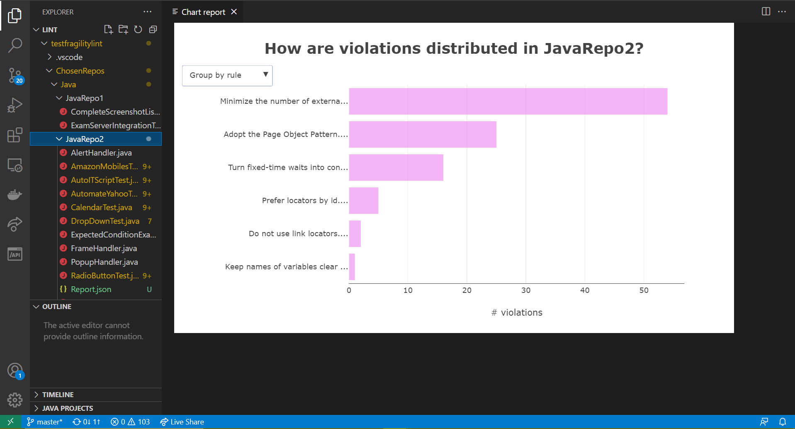
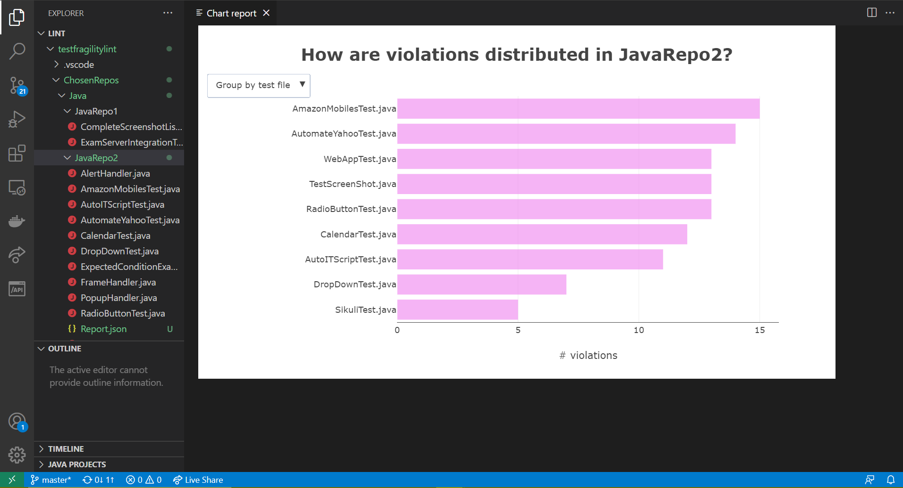

# TestFragilityLint

FragilityLint is a linter for GUI end-to-end test cases, designed to probe bad practices that determine their fragility. Fragility can be defined as the occurrence of breakages in a test suite in response to a modification in the application.

FragilityLint has been built for Selenium test suites, but some recommendations are tool-independent.
FragilityLint can inspect test files written either in Java or Javascript.

## Features

### Analyze your test case

FragilityLint inspects test cases and show fragility-related code smells by underlining the interested snippet.

Each bad practice is linked to a describing tooltip that appears when you hover the mouse over it.

The tooltip informs about what is the actual reason that makes the code a bad practice, along with the good practice that increase robustness thereof.

### Generate a chart report

Fragility Lint can collect and show violations in a report in the form of a chart, directly on a preview tab in VSCode.
Right click on a file (or folder) to request the generation of a chart report for the resource.

The chart can group recommendations by rule or test file, as shown in the two figures beneath:

This feature requires Internet connection because it leverages a third-party graphing library, Plotly.

## Requirements

### Dependencies

The linter does not require any manual installation. However, it depends upon:

- [java-parser](https://www.npmjs.com/package/java-parser);
- [acorn](https://www.npmjs.com/package/acorn);
- [Plotly](https://plotly.com/javascript/getting-started/).

## Extension Settings

No configuration is needed/available for the tool.

## Known Issues

No known issues so far. If you find some bug, please report it on the [GitHub page of the extension](https://github.com/Thefolle/ThesisFragility/issues).

## Release Notes

### 1.0.0

Initial release of FragilityLint.
