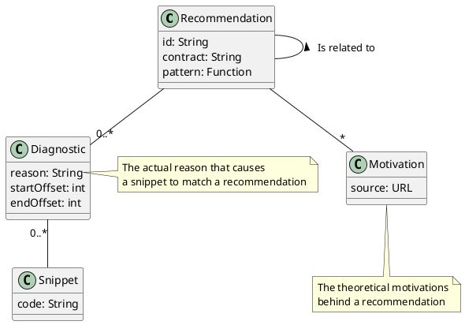

# Dictionary on Recommendation

```plantuml

@startuml

class Recommendation {
    id: String
    contract: String
    pattern: Function
}

class Motivation {
    source: URL
}

class Diagnostic {
    reason: String
    startOffset: int
    endOffset: int
}

class Snippet {
    code: String
}

Recommendation -- "*" Motivation
Recommendation -- "0..*" Diagnostic
Diagnostic "0..*" -- Snippet
Recommendation - Recommendation: Is related to <

note Bottom of Motivation: The theoretical motivations\nbehind a recommendation
note Left of Diagnostic::reason
    The actual reason that causes 
    a snippet to match a recommendation
end note

@enduml

```
